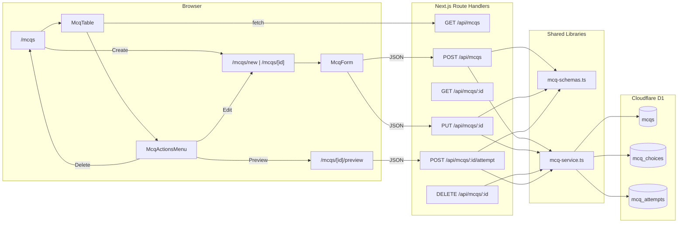

Date created: September 1, 2026
Date last modified: September 1, 2026 (Phase 5 verification complete)

# Multiple Choice Questions (MCQ CRUD) - Technical PRD

## Overview/Problem

Teachers who register and log in currently land on an MCQ workspace stub with no way to create, manage, or try quiz content. The authentication sprint established user identity in Cloudflare D1, but the core product value—building and using multiple-choice questions—does not exist yet.

**Implemented outcome:** Teachers can create, edit, preview, and delete multiple-choice questions from a table-based workspace. Each MCQ has a name, question text, and two to six choices with exactly one correct answer. Preview submissions record attempts in D1. Logout is available from the workspace header.

---

## Hypothesis

We believe that providing full MCQ create-read-update-delete flows—with a shadcn/ui table workspace, a shared create/edit form, preview with attempt recording, and a service layer over three D1 tables—will let teachers manage quiz content immediately after login, validating the data model and UI patterns needed for future collaboration features.

---

## Scope

### In Scope

- D1 migration for three tables: `mcqs`, `mcq_choices`, `mcq_attempts` (local apply only)
- MCQ service layer with CRUD, choice management, and attempt recording
- API route handlers for MCQ CRUD and attempt submission
- Zod validation on API payloads and service inputs
- Replace `/mcqs` stub with a listing table (name, question, actions)
- Create/edit page at `/mcqs/new` and `/mcqs/[id]` (shared form component)
- Preview page at `/mcqs/[id]/preview` (or inline preview mode on detail route)
- Row actions dropdown: Edit, Preview, Delete (vertical ellipsis trigger)
- shadcn/ui components: `table`, `button`, `dropdown-menu`, `field`, `input`, `dialog` (delete confirm)
- Vitest test suite for phases 1–4 (TDD: tests written before implementation in each phase)
- Post-auth navigation continues to `/mcqs` after login/register

### Out of Scope

- Associating MCQs with a specific user (`user_id` foreign key) — deferred until session management exists
- Route protection / auth guards on `/mcqs` routes — same as auth PRD (UX redirect only)
- Pagination, search, or filtering on the MCQ table
- Bulk import/export of questions
- AI-generated questions
- Remote D1 migration apply
- Collaboration, sharing, or permissions between teachers

### Cut

- **Server Actions for MCQ forms** — HTTP route handlers used instead (consistent with auth PRD)
- **Separate `/mcqs/[id]/edit` route** — single form component serves both create (`/mcqs/new`) and edit (`/mcqs/[id]`) to reduce duplication
- **Soft delete** — hard delete with cascade on choices; attempts retained or cascade per migration design below
- **Rich text / markdown for question body** — plain text only for MVP
- **Attempt analytics dashboard** — attempts are stored; reporting UI deferred

---

## Technical Requirements

### System Architecture



**Layering (enforced in code):**

1. Client components `fetch` JSON to API routes; no direct D1 access.
2. Route handlers validate with Zod, then call the MCQ service.
3. The MCQ service owns all D1 SQL; public `Mcq` objects include choices but never internal row shapes.
4. Route handlers → MCQ service → D1 (never query D1 from handlers directly).

---

### Database Schema

**Migration file:** `migrations/0002_create_mcq_tables.sql`

```sql
CREATE TABLE mcqs (
  id TEXT PRIMARY KEY DEFAULT (lower(hex(randomblob(16)))),
  name TEXT NOT NULL,
  question TEXT NOT NULL,
  created_at DATETIME DEFAULT CURRENT_TIMESTAMP,
  updated_at DATETIME DEFAULT CURRENT_TIMESTAMP
);

CREATE TABLE mcq_choices (
  id TEXT PRIMARY KEY DEFAULT (lower(hex(randomblob(16)))),
  mcq_id TEXT NOT NULL,
  choice_text TEXT NOT NULL,
  is_correct INTEGER NOT NULL DEFAULT 0 CHECK (is_correct IN (0, 1)),
  sort_order INTEGER NOT NULL,
  created_at DATETIME DEFAULT CURRENT_TIMESTAMP,
  updated_at DATETIME DEFAULT CURRENT_TIMESTAMP,
  FOREIGN KEY (mcq_id) REFERENCES mcqs(id) ON DELETE CASCADE
);

CREATE INDEX idx_mcq_choices_mcq_id ON mcq_choices(mcq_id);

CREATE TABLE mcq_attempts (
  id TEXT PRIMARY KEY DEFAULT (lower(hex(randomblob(16)))),
  mcq_id TEXT NOT NULL,
  choice_id TEXT NOT NULL,
  is_correct INTEGER NOT NULL CHECK (is_correct IN (0, 1)),
  created_at DATETIME DEFAULT CURRENT_TIMESTAMP,
  FOREIGN KEY (mcq_id) REFERENCES mcqs(id) ON DELETE CASCADE,
  FOREIGN KEY (choice_id) REFERENCES mcq_choices(id) ON DELETE CASCADE
);

CREATE INDEX idx_mcq_attempts_mcq_id ON mcq_attempts(mcq_id);
```

**Design notes:**

| Table | Purpose |
|-------|---------|
| `mcqs` | Question metadata: `name` (short label for table), `question` (prompt shown to user) |
| `mcq_choices` | 2–6 choices per MCQ; exactly one must have `is_correct = 1` |
| `mcq_attempts` | Records which `choice_id` was selected and whether it matched the correct answer |

**Validation rules (enforced in service + Zod):**

- `name`: non-empty string, max 200 characters
- `question`: non-empty string, max 2000 characters
- `choices`: array length 2–6; each `choiceText` non-empty; exactly one `isCorrect: true`
- `sortOrder`: 0-based contiguous indices assigned on create/update

---

### API Endpoints

#### GET /api/mcqs

**Response:**

- Success (200): `{ "mcqs": McqSummary[] }` where summary includes `id`, `name`, `question`, `createdAt`, `updatedAt` (no choices)
- Error (500): `{ "error": "Internal server error" }`

#### POST /api/mcqs

**Request body:**

```json
{
  "name": "Photosynthesis basics",
  "question": "Which organelle performs photosynthesis?",
  "choices": [
    { "choiceText": "Mitochondria", "isCorrect": false },
    { "choiceText": "Chloroplast", "isCorrect": true }
  ]
}
```

**Responses:**

| Code | Body |
|------|------|
| 201 | `{ "mcq": Mcq }` — full object with choices |
| 400 | `{ "error": "<validation message>" }` |
| 500 | `{ "error": "Internal server error" }` |

#### GET /api/mcqs/:id

**Responses:**

| Code | Body |
|------|------|
| 200 | `{ "mcq": Mcq }` |
| 404 | `{ "error": "MCQ not found" }` |
| 500 | `{ "error": "Internal server error" }` |

#### PUT /api/mcqs/:id

**Request body:** same shape as POST (full replace of name, question, choices)

**Responses:**

| Code | Body |
|------|------|
| 200 | `{ "mcq": Mcq }` |
| 400 | `{ "error": "<validation message>" }` |
| 404 | `{ "error": "MCQ not found" }` |
| 500 | `{ "error": "Internal server error" }` |

#### DELETE /api/mcqs/:id

**Responses:**

| Code | Body |
|------|------|
| 200 | `{ "message": "MCQ deleted" }` |
| 404 | `{ "error": "MCQ not found" }` |
| 500 | `{ "error": "Internal server error" }` |

#### POST /api/mcqs/:id/attempt

**Request body:**

```json
{
  "choiceId": "<uuid>"
}
```

**Responses:**

| Code | Body |
|------|------|
| 201 | `{ "attempt": { "id", "mcqId", "choiceId", "isCorrect", "createdAt" } }` |
| 400 | `{ "error": "<validation message>" }` — invalid choice or choice not belonging to MCQ |
| 404 | `{ "error": "MCQ not found" }` |
| 500 | `{ "error": "Internal server error" }` |

**Public types:**

```typescript
type McqChoice = {
  id: string;
  choiceText: string;
  isCorrect: boolean;
  sortOrder: number;
};

type Mcq = {
  id: string;
  name: string;
  question: string;
  choices: McqChoice[];
  createdAt: string;
  updatedAt: string;
};

type McqSummary = Omit<Mcq, "choices">;
```

---

### User Interface Requirements

#### MCQ List Page (`/mcqs`)

- Page title: **MCQ Workspace**
- Primary action: **Create MCQ** button → navigates to `/mcqs/new`
- shadcn `Table` with columns:
  - **Name** — MCQ `name`
  - **Question** — MCQ `question` (truncated with `line-clamp` or max width)
  - **Actions** — vertical ellipsis (`MoreVertical` icon) opening `DropdownMenu`
- Dropdown items:
  - **Edit** → `/mcqs/[id]`
  - **Preview** → `/mcqs/[id]/preview`
  - **Delete** → confirmation `Dialog`, then `DELETE /api/mcqs/:id`, refresh list
- Empty state when no MCQs: message + Create button
- Loading and error states for list fetch

#### Create / Edit Page (`/mcqs/new`, `/mcqs/[id]`)

- Shared client form component `McqForm`
- Fields:
  - **Name** (required)
  - **Question** (required, textarea or multi-line input)
  - **Choices** — minimum 2, maximum 6; each row has text input + radio to mark correct answer
  - **Add choice** button (disabled at 6 choices)
  - **Remove choice** button per row (disabled when only 2 remain)
- Footer actions:
  - **Save** — POST (create) or PUT (edit); redirect to `/mcqs` on success
  - **Cancel** — navigate back to `/mcqs` without saving
- Client-side validation mirrors API rules before submit
- Edit mode: load MCQ via GET on mount; show loading state

#### Preview Page (`/mcqs/[id]/preview`)

- Display question text and choices as selectable radio options
- **Submit answer** button → POST `/api/mcqs/:id/attempt`
- Show result: correct/incorrect feedback after submission
- **Back to list** link/button

---

## Implementation Phases

Each phase follows **TDD**: write failing tests first, implement until green, refactor, then run lint and build.

### Phase 1: Database Migration — COMPLETED

**Objective:** MCQ schema migration exists, applies locally, and is verified by automated tests.

**TDD sequence:**

1. Add `tests/phase4-mcq/database-foundation.test.ts` (or `tests/mcq/phase1/...`) asserting migration file content and local apply
2. Create `migrations/0002_create_mcq_tables.sql`
3. Run tests until green

**Tasks:**

1. Create migration SQL for `mcqs`, `mcq_choices`, `mcq_attempts` with indexes and FK cascades
2. Apply locally: `npx wrangler d1 migrations apply aisprint-quizmaker-db --local`
3. Extend phase-1-style tests to verify table columns via `PRAGMA table_info`

**Deliverables:**

| Item | Location |
|------|----------|
| Migration | `migrations/0002_create_mcq_tables.sql` |
| Tests | `tests/mcq/phase1/database-foundation.test.ts` |

**Test cases (minimum):**

- Migration file exists with all three `CREATE TABLE` statements
- Foreign keys and indexes present
- Local apply succeeds without error
- `PRAGMA table_info` confirms expected columns for each table

---

### Phase 2: MCQ Service — COMPLETED

**Objective:** All MCQ CRUD, choice persistence, and attempt recording in one service module.

**TDD sequence:**

1. Extend `tests/helpers/in-memory-d1.ts` (or add `in-memory-mcq-d1.ts`) to support MCQ tables
2. Write `tests/mcq/phase2/mcq-service.test.ts` with failing tests for each public method
3. Implement `src/lib/services/mcq-service.ts` and `mcq-service.types.ts`

**Public API:**

| Method | Behavior |
|--------|----------|
| `createMcq(db, input)` | Insert MCQ + choices in transaction; returns full `Mcq` |
| `listMcqs(db)` | Returns `McqSummary[]` ordered by `updated_at DESC` |
| `getMcqById(db, id)` | Returns `Mcq \| null` with choices ordered by `sort_order` |
| `updateMcq(db, id, input)` | Replace name, question, choices; throws `McqNotFoundError` |
| `deleteMcq(db, id)` | Hard delete MCQ (cascade choices); returns `boolean` |
| `recordAttempt(db, mcqId, choiceId)` | Validates choice belongs to MCQ; inserts attempt; returns attempt |

**Error classes:**

- `McqNotFoundError`
- `InvalidChoiceError` — choice not found or not owned by MCQ
- `McqValidationError` — business rule failures (choice count, single correct answer)

**Conventions (match user service):**

- `import "server-only"` at top of `mcq-service.ts`
- Prepared statements with numbered placeholders (`?1`, `?2`, …)
- Zod schemas in `mcq-service.types.ts`
- Map DB rows (`snake_case`) to public types (`camelCase`)

**Deliverables:**

| File | Purpose |
|------|---------|
| `src/lib/services/mcq-service.ts` | D1 queries, errors, public API |
| `src/lib/services/mcq-service.types.ts` | Zod schemas, types, row types |
| `tests/helpers/in-memory-d1.ts` | Extended mock for MCQ tables |
| `tests/mcq/phase2/mcq-service.test.ts` | Service unit tests |

**Test cases (minimum):**

- `createMcq` with 2 choices returns MCQ with generated IDs
- `createMcq` rejects fewer than 2 or more than 6 choices
- `createMcq` rejects zero or multiple correct answers
- `listMcqs` returns summaries without choice arrays
- `getMcqById` returns null for unknown id
- `updateMcq` replaces choices atomically
- `updateMcq` throws `McqNotFoundError` for missing id
- `deleteMcq` removes MCQ and returns true; false when not found
- `recordAttempt` stores `is_correct` based on selected choice
- `recordAttempt` throws for choice not belonging to MCQ

---

### Phase 3: MCQ API Endpoints — COMPLETED

**Objective:** HTTP route handlers for list, create, read, update, delete, and attempt recording.

**TDD sequence:**

1. Write `tests/mcq/phase3/mcq-api.test.ts` importing route handlers directly (same pattern as auth API tests)
2. Implement routes under `src/app/api/mcqs/`
3. Add `src/lib/mcq/mcq-schemas.ts` and `mcq-utils.ts` (mirror auth module layout)

**Routes:**

| Route | File |
|-------|------|
| `GET`, `POST /api/mcqs` | `src/app/api/mcqs/route.ts` |
| `GET`, `PUT`, `DELETE /api/mcqs/[id]` | `src/app/api/mcqs/[id]/route.ts` |
| `POST /api/mcqs/[id]/attempt` | `src/app/api/mcqs/[id]/attempt/route.ts` |

**Deliverables:**

| File | Purpose |
|------|---------|
| `src/lib/mcq/mcq-schemas.ts` | Request/response Zod schemas |
| `src/lib/mcq/mcq-utils.ts` | `readJsonBody`, `validationErrorMessage` (reuse or share with auth) |
| `tests/mcq/phase3/mcq-api.test.ts` | Endpoint integration tests |

**Test cases (minimum):**

- POST create returns 201 with MCQ
- POST with invalid payload returns 400
- GET list returns 200 with array
- GET by id returns 200 / 404
- PUT updates and returns 200 / 404 / 400
- DELETE returns 200 / 404
- POST attempt returns 201 with `isCorrect` / 400 / 404

---

### Phase 4: Frontend MCQ Workspace — COMPLETED

**Objective:** Replace stub page with full CRUD UI using shadcn components.

**TDD sequence:**

1. Add shadcn `dropdown-menu` component: `npx shadcn@latest add @shadcn/dropdown-menu`
2. Optionally add component tests for `McqForm` validation logic extracted to a pure function (`mcq-form-validation.ts`) — testable without DOM
3. Implement pages and components; manual verification for full flows

**Tasks:**

1. Install `dropdown-menu` shadcn component
2. Build `McqTable`, `McqActionsMenu`, `McqForm` client components
3. Replace `src/app/mcqs/page.tsx` with list + fetch
4. Add `src/app/mcqs/new/page.tsx` and `src/app/mcqs/[id]/page.tsx`
5. Add `src/app/mcqs/[id]/preview/page.tsx`
6. Wire delete confirmation dialog

**Deliverables:**

| File | Purpose |
|------|---------|
| `src/components/mcq-table.tsx` | List table |
| `src/components/mcq-actions-menu.tsx` | Ellipsis dropdown |
| `src/components/mcq-form.tsx` | Create/edit form |
| `src/app/mcqs/page.tsx` | List page |
| `src/app/mcqs/new/page.tsx` | Create page |
| `src/app/mcqs/[id]/page.tsx` | Edit page |
| `src/app/mcqs/[id]/preview/page.tsx` | Preview + attempt |
| `src/components/ui/dropdown-menu.tsx` | shadcn component (generated) |
| `tests/mcq/phase4/mcq-form-validation.test.ts` | Optional pure validation tests |

**UI conventions:**

- Use existing `Button`, `Table`, `Field`, `Input`, `Dialog` from shadcn
- Set `nativeButton={false}` on `Button render={<Link />}` (Base UI pattern from auth)
- Truncate long question text in table; full text on edit/preview pages

---

### Phase 5: Verification — COMPLETED

**Objective:** Confirm the feature meets acceptance criteria via automated checks and manual testing.

**Automated verification:**

| Check | Command | Result |
|-------|---------|--------|
| Unit/integration tests | `npm run test` | **70 passed** (auth 27 + MCQ phase 1: 8, phase 2: 15, phase 3: 13, phase 4: 7) |
| Lint | `npm run lint` | **Pass** |
| Production build | `npm run build` | **Pass** — all routes compiled |

**Manual verification (local, user-confirmed September 1, 2026):**

- [x] Create MCQ with 2 choices from `/mcqs/new` → appears in table
- [x] Edit MCQ: add choices up to 6, change correct answer, save
- [x] Preview MCQ: submit correct and incorrect answers; feedback shown on page
- [x] Delete MCQ from actions menu → removed from table
- [x] Cancel on form returns to list without changes
- [x] Logout from workspace header → returns to login
- [x] Validation errors shown for invalid form input

**Runtime note:** D1-backed flows verified locally; use `npm run preview` for Workers runtime when binding behaviour matters.

---

## Complete File Inventory (Planned)

### Configuration and schema

```
migrations/0002_create_mcq_tables.sql   — MCQ schema migration
```

### Application source

```
src/lib/mcq/mcq-schemas.ts              — API request Zod schemas
src/lib/mcq/mcq-utils.ts                — JSON body + error helpers
src/lib/services/mcq-service.ts         — D1 MCQ CRUD + attempts
src/lib/services/mcq-service.types.ts   — types + service Zod schemas

src/app/api/mcqs/route.ts               — GET list, POST create
src/app/api/mcqs/[id]/route.ts          — GET, PUT, DELETE
src/app/api/mcqs/[id]/attempt/route.ts  — POST attempt

src/components/mcq-table.tsx
src/components/mcq-actions-menu.tsx
src/components/mcq-form.tsx
src/components/ui/dropdown-menu.tsx     — shadcn (generated)

src/app/mcqs/page.tsx                   — list workspace
src/app/mcqs/new/page.tsx               — create
src/app/mcqs/[id]/page.tsx              — edit
src/app/mcqs/[id]/preview/page.tsx      — preview + attempt
```

### Tests

```
tests/mcq/phase1/database-foundation.test.ts
tests/mcq/phase2/mcq-service.test.ts
tests/mcq/phase3/mcq-api.test.ts
tests/mcq/phase4/mcq-form-validation.test.ts   — optional
tests/helpers/in-memory-d1.ts                  — extended for MCQ
```

---

## Acceptance Criteria

- [x] Migration `0002_create_mcq_tables.sql` creates `mcqs`, `mcq_choices`, `mcq_attempts` locally
- [x] MCQ service exposes create, list, getById, update, delete, and recordAttempt
- [x] Service validates 2–6 choices and exactly one correct answer
- [x] `GET /api/mcqs` returns all MCQ summaries
- [x] `POST /api/mcqs` creates MCQ with choices and returns 201
- [x] `GET /api/mcqs/:id` returns full MCQ or 404
- [x] `PUT /api/mcqs/:id` updates MCQ or returns 404/400
- [x] `DELETE /api/mcqs/:id` deletes MCQ or returns 404
- [x] `POST /api/mcqs/:id/attempt` records attempt with correct `isCorrect` flag
- [x] `/mcqs` lists MCQs in a table with name, question, and actions dropdown
- [x] Create button navigates to `/mcqs/new`; save creates MCQ and returns to list
- [x] Edit loads existing MCQ; save updates and returns to list
- [x] Cancel returns to list without persisting unsaved changes (navigate away)
- [x] Preview allows answering and shows correct/incorrect feedback
- [x] Delete removes MCQ after confirmation
- [x] `npm run test`, `npm run lint`, and `npm run build` pass

---

## Success Metrics

| Metric | Target | Result |
|--------|--------|--------|
| MCQ create flow | User saves new MCQ and sees it in table | Verified locally + API tests |
| MCQ edit flow | User updates choices and correct answer persists | Verified locally + service tests |
| Attempt recording | Preview submit creates row in `mcq_attempts` | Service test + manual preview |
| Automated coverage | Phases 1–4 fully tested | 43 MCQ tests + 27 auth tests |
| Zero D1 in handlers | Handlers only call service | Enforced in route handlers |

---

## Dependencies

### External

- **Cloudflare D1** — MCQ persistence (existing binding `DB`)
- **zod** — validation (already installed)
- **vitest** — test runner (already installed)

### Internal

- **`getCloudflareContext()`** — D1 access in route handlers
- **shadcn/ui** — `button`, `table`, `field`, `input`, `dialog`, `dropdown-menu` (to add)
- **In-memory D1 mock** — extended for MCQ tables
- **User authentication** — login/register redirect to `/mcqs` (no code changes required)

### New shadcn Component

```bash
npx shadcn@latest add @shadcn/dropdown-menu
```

---

## Risks and Mitigation

### Technical Risks

| Risk | Mitigation |
|------|------------|
| Choice replace on update loses attempt FK integrity | CASCADE deletes attempts when choices replaced; acceptable for MVP |
| Transaction support in D1 batch | Use `db.batch()` for insert MCQ + choices atomically |
| In-memory D1 mock drift from real SQL | Keep mock SQL patterns aligned with service queries; phase 1 applies real migration |
| D1 unavailable in `npm run dev` | Document `npm run preview` for integration testing |

### UX Risks

| Risk | Mitigation |
|------|------------|
| Long question text breaks table layout | Truncate with CSS; full text on detail pages |
| User forgets to mark correct answer | Client + server validation with clear error message |
| Delete without confirmation | Require Dialog confirmation before DELETE |

---

## Troubleshooting Guide

### MCQ list returns empty but data exists in D1

**Problem:** Table shows empty state after create  
**Cause:** List fetch failed or dev binding unavailable  
**Solution:** Check network tab for `GET /api/mcqs`; test with `npm run preview`

### Attempt returns 400 for valid-looking choice

**Problem:** POST attempt fails with invalid choice  
**Cause:** `choiceId` from stale preview after edit deleted old choices  
**Solution:** Reload preview page after MCQ edit

### Dropdown menu not rendering

**Problem:** Actions column empty or menu fails  
**Cause:** `dropdown-menu` shadcn component not installed  
**Solution:** Run `npx shadcn@latest add @shadcn/dropdown-menu`

---

## Notes for AI Agents

When implementing this feature:

1. Follow **TDD per phase**: write failing tests first, then implement
2. Do **not** apply migrations to remote D1
3. Route handlers → MCQ service → D1 (never query D1 from handlers directly)
4. Reuse patterns from `user-service.ts` and auth API routes
5. Extend `in-memory-d1.ts` rather than hitting real D1 in unit tests
6. Run `npm run test`, `npm run lint`, and `npm run build` before marking work complete
7. Test D1 flows on `npm run preview` when binding behaviour matters
8. Update phase status markers and acceptance checkboxes in this PRD as work progresses

---

## Current Status

**Last Updated:** September 1, 2026  
**Feature Status:** **IMPLEMENTATION COMPLETE** (Phases 1–5)  
**Automated tests:** 70/70 passing  
**Manual verification:** Create, edit, preview, delete, cancel, logout confirmed locally  
**Next sprint:** User–MCQ ownership when session management exists; MCQ pagination/search TBD
