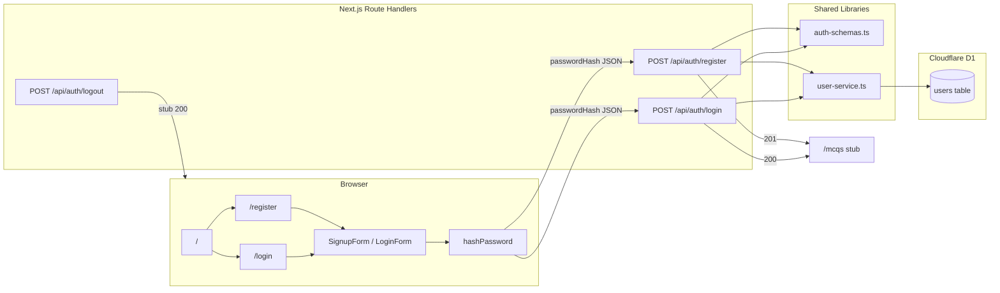

Date created: August 24, 2026
Date last modified: August 26, 2026

# User Authentication - Technical PRD

## Overview/Problem

Quizmaker is a greenfield application where multiple teachers will collaborate to create multiple-choice questions. That collaboration requires each teacher to have a distinct identity in the system. The starter project had no user accounts, no persistence for identity, and no path from sign-up into the quiz-creation workflow.

**Implemented outcome:** Teachers can register, log in, and reach an MCQ workspace stub. Passwords are hashed in the browser before HTTP POST. User identity is persisted in Cloudflare D1. Session management is intentionally deferred.

---

## Hypothesis

We believe that providing email-and-password registration, login, and logout—with passwords hashed in the browser before any HTTP POST—will let multiple teachers create accounts and reach an MCQ workspace stub quickly, establishing the identity layer needed for collaboration without the complexity of sessions or social providers.

**Status:** Validated through automated tests (27 passing) and manual local verification of register, login, and logout flows.

---

## Scope

### In Scope (Implemented)

- D1 database with `users` table migration (local apply only)
- User service with CRUD and credential verification
- Auth API endpoints: register, login, logout (stub)
- Client-side SHA-256 password hashing before POST
- Registration, login, and MCQ stub UI pages
- Home page navigation to auth flows
- Zod validation on API payloads and service inputs
- Vitest test suite for phases 1–3
- Post-auth redirect to `/mcqs`

### Out of Scope (Unchanged)

- Social / OAuth login
- Session management (cookies, JWTs, server-side sessions)
- Password reset or email verification
- Role-based access control
- MCQ creation, editing, listing, or collaboration
- Route protection for `/mcqs` (redirect is UX-only)
- Remote D1 migration apply

### Cut (Unchanged)

- Server Actions for auth forms — HTTP POST route handlers used instead
- Server-side bcrypt/argon2 — client hash stored/compared directly (MVP trade-off)
- Remember-me / persistent login — deferred with sessions
- Rate limiting on auth endpoints — deferred
- Google sign-in buttons from shadcn templates — removed (OAuth out of scope)

---

## Technical Requirements

### System Architecture (As Built)



**Layering (enforced in code):**

1. Client components hash passwords, then `fetch` POST to API routes.
2. Route handlers validate with Zod (`auth-schemas.ts`), then call the user service.
3. The user service owns all D1 SQL; public `User` objects never include `password_hash`.
4. Logout API is a stub; UI logout is navigation back to `/login`.

---

## Implementation Phases

### Phase 1: Database Setup and Migration — COMPLETED

**Objective:** D1 configured locally; `users` table migration exists and applies.

**Implemented:**

| Item | Location | Notes |
|------|----------|-------|
| D1 database | `aisprint-quizmaker-db` | Created via `wrangler d1 create --temporary` |
| Wrangler binding | `wrangler.jsonc:21-27` | Binding name `DB` |
| Migration | `migrations/0001_create_users_table.sql` | Users table + email index |
| Typed binding | `cloudflare-env.d.ts:4-12` | `DB: D1Database` after `npm run cf-typegen` |
| Tests | `tests/phase1/database-foundation.test.ts` | 5 tests |

**Database ID:** `6b50af31-23e1-42b5-90b8-dc37aa5ab101`

**Migration SQL (as applied):**

```1:11:migrations/0001_create_users_table.sql
CREATE TABLE users (
  id TEXT PRIMARY KEY DEFAULT (lower(hex(randomblob(16)))),
  email TEXT NOT NULL UNIQUE,
  password_hash TEXT NOT NULL,
  first_name TEXT NOT NULL,
  last_name TEXT NOT NULL,
  created_at DATETIME DEFAULT CURRENT_TIMESTAMP,
  updated_at DATETIME DEFAULT CURRENT_TIMESTAMP
);

CREATE INDEX idx_users_email ON users(email);
```

**D1 binding configuration:**

```21:27:wrangler.jsonc
	"d1_databases": [
		{
			"binding": "DB",
			"database_name": "aisprint-quizmaker-db",
			"database_id": "6b50af31-23e1-42b5-90b8-dc37aa5ab101"
		}
	]
```

**Git:** Committed on `feat/user-authentication` as `25e0bd6` — `feat: implement phase 1 user database setup`

---

### Phase 2: User Service — COMPLETED

**Objective:** All user CRUD and credential verification in one service module.

**Implemented files:**

| File | Purpose |
|------|---------|
| `src/lib/services/user-service.ts` | D1 queries, error classes, public API |
| `src/lib/services/user-service.types.ts` | Zod schemas, `User`, row types |
| `tests/helpers/in-memory-d1.ts` | In-memory D1 mock for unit tests |
| `tests/phase2/user-service.test.ts` | 14 tests |

**Public API (implemented methods):**

| Method | Behavior |
|--------|----------|
| `createUser(db, input)` | Insert user; throws `DuplicateEmailError` on conflict |
| `getUserById(db, id)` | Returns `User \| null` |
| `getUserByEmail(db, email)` | Case-insensitive lookup; returns `User \| null` |
| `updateUser(db, id, input)` | Partial merge update; throws `UserNotFoundError` |
| `deleteUser(db, id)` | Hard delete; returns `boolean` |
| `verifyCredentials(db, email, passwordHash)` | Compares hash; returns `User \| null` |

**Error classes:**

```13:25:src/lib/services/user-service.ts
export class DuplicateEmailError extends Error {
  constructor(email: string) {
    super(`An account with email ${email} already exists`);
    this.name = "DuplicateEmailError";
  }
}

export class UserNotFoundError extends Error {
  constructor(id: string) {
    super(`User ${id} not found`);
    this.name = "UserNotFoundError";
  }
}
```

**Conventions enforced:**
- `import "server-only"` at top of `user-service.ts` — never imported from client components
- Prepared statements with numbered placeholders (`?1`, `?2`, …)
- Email normalized to lowercase on write and lookup
- Zod validation via `createUserInputSchema` / `updateUserInputSchema`

**Dependencies added:** `zod@^4.4.3` in `package.json`

---

### Phase 3: Authentication API Endpoints — COMPLETED

**Objective:** Register, login, and logout HTTP endpoints wired to the user service.

**Implemented routes:**

| Route | File | Status codes |
|-------|------|--------------|
| `POST /api/auth/register` | `src/app/api/auth/register/route.ts` | 201, 400, 409, 500 |
| `POST /api/auth/login` | `src/app/api/auth/login/route.ts` | 200, 400, 401, 500 |
| `POST /api/auth/logout` | `src/app/api/auth/logout/route.ts` | 200 (stub) |

**Supporting modules:**

| File | Purpose |
|------|---------|
| `src/lib/auth/auth-schemas.ts` | `registerRequestSchema`, `loginRequestSchema` |
| `src/lib/auth/auth-utils.ts` | `readJsonBody`, `validationErrorMessage` |
| `tests/phase3/auth-api.test.ts` | 8 endpoint tests |

**Register handler (pattern):**

```9:27:src/app/api/auth/register/route.ts
export async function POST(request: Request) {
  try {
    const body = await readJsonBody(request);
    if (body === null) {
      return Response.json({ error: "Invalid request body" }, { status: 400 });
    }

    const parsed = registerRequestSchema.safeParse(body);
    if (!parsed.success) {
      return Response.json(
        { error: validationErrorMessage(parsed.error) },
        { status: 400 },
      );
    }

    const { env } = getCloudflareContext();
    const user = await createUser(env.DB, parsed.data);

    return Response.json({ user }, { status: 201 });
```

**API request schemas:**

```3:13:src/lib/auth/auth-schemas.ts
export const registerRequestSchema = z.object({
  email: z.string().email(),
  passwordHash: z.string().min(1),
  firstName: z.string().min(1),
  lastName: z.string().min(1),
});

export const loginRequestSchema = z.object({
  email: z.string().email(),
  passwordHash: z.string().min(1),
});
```

**Logout stub:**

```1:3:src/app/api/auth/logout/route.ts
export async function POST() {
  return Response.json({ message: "Logged out" }, { status: 200 });
}
```

---

### Phase 4: Password Hashing and Frontend Authentication Flow — COMPLETED

**Objective:** Browser-side hashing; registration and login UI wired to auth APIs; post-auth navigation to MCQ stub.

**Implemented files:**

| File | Purpose |
|------|---------|
| `src/lib/auth/hash-password.ts` | Web Crypto SHA-256 hashing |
| `src/components/signup-form.tsx` | Registration form (`'use client'`) |
| `src/components/login-form.tsx` | Login form (`'use client'`) |
| `src/app/register/page.tsx` | `/register` route |
| `src/app/login/page.tsx` | `/login` route |
| `src/app/mcqs/page.tsx` | `/mcqs` post-auth stub |
| `src/app/page.tsx` | Home with auth navigation |

**Password hashing (Web Crypto API, no extra dependency):**

```1:8:src/lib/auth/hash-password.ts
export async function hashPassword(plainPassword: string): Promise<string> {
  const encoder = new TextEncoder();
  const data = encoder.encode(plainPassword);
  const hashBuffer = await crypto.subtle.digest("SHA-256", data);
  return Array.from(new Uint8Array(hashBuffer))
    .map((byte) => byte.toString(16).padStart(2, "0"))
    .join("");
}
```

**Registration submit flow:**

```64:84:src/components/signup-form.tsx
    try {
      const passwordHash = await hashPassword(password);
      const response = await fetch("/api/auth/register", {
        method: "POST",
        headers: { "Content-Type": "application/json" },
        body: JSON.stringify({
          email,
          passwordHash,
          firstName,
          lastName,
        }),
      });

      const body = (await response.json()) as { error?: string };

      if (!response.ok) {
        setError(body.error ?? "Unable to create account. Please try again.");
        return;
      }

      router.push("/mcqs");
```

**Login submit flow:**

```55:74:src/components/login-form.tsx
    try {
      const passwordHash = await hashPassword(password);
      const response = await fetch("/api/auth/login", {
        method: "POST",
        headers: { "Content-Type": "application/json" },
        body: JSON.stringify({ email, passwordHash }),
      });

      if (!response.ok) {
        if (response.status === 401) {
          setError("Invalid email or password.");
          return;
        }
        // ...
      }

      router.push("/mcqs");
```

**UI adaptations from shadcn templates:**
- Split "Full Name" into `firstName` + `lastName` (PRD + API requirement)
- Removed Google OAuth buttons (out of scope)
- Removed "Forgot password" link (out of scope)
- Errors displayed via `FieldError`
- Cross-links: `/register` ↔ `/login`
- Home page uses `Button` with `nativeButton={false}` when rendering as `Link` (Base UI accessibility)

**Client-side validation (signup-form):**
- All fields required
- Email format regex
- Password minimum 8 characters
- Confirm password must match

**Client-side validation (login-form):**
- Email and password required
- Email format regex
- 401 responses show generic "Invalid email or password."

**MCQ stub page:**

```4:18:src/app/mcqs/page.tsx
export default function McqsPage() {
  return (
    <div className="flex min-h-svh w-full items-center justify-center p-6 md:p-10">
      <div className="flex w-full max-w-lg flex-col gap-4 text-center">
        <h1 className="text-3xl font-semibold tracking-tight">MCQ Workspace</h1>
        <p className="text-muted-foreground">
          You&apos;ve reached the post-auth destination. Full MCQ creation
          arrives in the next sprint.
        </p>
        <div className="flex justify-center">
          <Link href="/login">
            <Button variant="outline" type="button">
              Back to login
            </Button>
          </Link>
```

**Logout behaviour:** No persistent session exists. Logout is satisfied by calling `POST /api/auth/logout` (stub returns 200) and/or navigating away from `/mcqs` to `/login`. The MCQ stub provides a "Back to login" link for this UX.

---

### Phase 5: Verification — COMPLETED

**Objective:** Confirm the feature meets acceptance criteria via automated checks and manual testing.

**Automated verification:**

| Check | Command | Result |
|-------|---------|--------|
| Unit/integration tests | `npm run test` | **27 passed** (Phase 1: 5, Phase 2: 14, Phase 3: 8) |
| Lint | `npm run lint` | **Pass** |
| Production build | `npm run build` | **Pass** — all routes compiled |

**Test infrastructure:**

| File | Purpose |
|------|---------|
| `vitest.config.ts` | Vitest config (node environment, `@/` paths) |
| `package.json` scripts | `"test"`, `"test:watch"` |
| `tests/phase1/database-foundation.test.ts` | D1 config, migration, local apply |
| `tests/phase2/user-service.test.ts` | User service CRUD + credentials |
| `tests/phase3/auth-api.test.ts` | Auth API endpoints |
| `tests/helpers/in-memory-d1.ts` | D1 mock for phases 2–3 |

**Manual verification (local, user-confirmed August 26, 2026):**

- Register new user at `/register` → redirects to `/mcqs`
- Log in at `/login` → redirects to `/mcqs`
- Log out (via logout flow / return to login)
- Duplicate email registration shows clear error
- Invalid login shows generic error message

**Runtime note:** D1-backed auth is most reliable on the Workers runtime (`npm run preview`). Local development (`npm run dev` on port 3000) may behave differently depending on binding availability; user confirmed flows working in their local environment.

---

## Complete File Inventory

### Configuration and schema

```
wrangler.jsonc                          — D1 DB binding (DB)
migrations/0001_create_users_table.sql — users table migration
cloudflare-env.d.ts                     — generated; DB: D1Database
vitest.config.ts                        — test runner config
package.json                            — zod, vitest, test scripts
```

### Application source

```
src/lib/auth/hash-password.ts           — client-side SHA-256
src/lib/auth/auth-schemas.ts            — API request Zod schemas
src/lib/auth/auth-utils.ts              — JSON body + error helpers
src/lib/services/user-service.ts        — D1 user CRUD + verifyCredentials
src/lib/services/user-service.types.ts  — types + service Zod schemas

src/app/api/auth/register/route.ts      — POST register
src/app/api/auth/login/route.ts         — POST login
src/app/api/auth/logout/route.ts        — POST logout stub

src/components/signup-form.tsx          — registration form
src/components/login-form.tsx             — login form

src/app/page.tsx                        — home (links to register/login)
src/app/register/page.tsx               — registration page
src/app/login/page.tsx                  — login page
src/app/mcqs/page.tsx                   — MCQ workspace stub
```

### Tests

```
tests/phase1/database-foundation.test.ts
tests/phase2/user-service.test.ts
tests/phase3/auth-api.test.ts
tests/helpers/in-memory-d1.ts
```

---

## API Reference (As Built)

### POST /api/auth/register

**Request:**
```json
{
  "email": "teacher@school.edu",
  "passwordHash": "<sha256-hex-from-browser>",
  "firstName": "Jane",
  "lastName": "Doe"
}
```

**Responses:**
| Code | Body |
|------|------|
| 201 | `{ "user": { "id", "email", "firstName", "lastName", "createdAt", "updatedAt" } }` |
| 400 | `{ "error": "<validation message>" }` |
| 409 | `{ "error": "An account with this email already exists" }` |
| 500 | `{ "error": "Internal server error" }` |

### POST /api/auth/login

**Request:**
```json
{
  "email": "teacher@school.edu",
  "passwordHash": "<sha256-hex-from-browser>"
}
```

**Responses:**
| Code | Body |
|------|------|
| 200 | `{ "user": { ... } }` |
| 400 | `{ "error": "<validation message>" }` |
| 401 | `{ "error": "Invalid email or password" }` |
| 500 | `{ "error": "Internal server error" }` |

### POST /api/auth/logout

**Request:** empty body or `{}`

**Response:** `200` — `{ "message": "Logged out" }`

---

## Acceptance Criteria

- [x] D1 database configured in `wrangler.jsonc` with binding name `DB`
- [x] Users table migration exists under `migrations/`
- [x] User service exposes create, read (by id and email), update, delete, and `verifyCredentials`
- [x] `POST /api/auth/register` creates a user and returns user object without password hash
- [x] `POST /api/auth/login` returns user on valid credentials and 401 on invalid credentials
- [x] `POST /api/auth/logout` returns 200 with acknowledgment message
- [x] Plaintext password never appears in HTTP request bodies (only client-side hash)
- [x] Registration form validates inputs and redirects to `/mcqs` on success
- [x] Login form validates inputs and redirects to `/mcqs` on success
- [x] Duplicate email registration returns a clear error in the UI
- [x] `/mcqs` stub page renders with placeholder content
- [x] `npm run lint` passes
- [x] `npm run build` passes
- [x] Auth flows verified locally (register, login, logout)

---

## Success Metrics

| Metric | Target | Result |
|--------|--------|--------|
| Registration completion | User reaches `/mcqs` after valid registration | Verified locally |
| Login completion | User reaches `/mcqs` after valid login | Verified locally |
| No plaintext on wire | Request bodies contain `passwordHash` only | Implemented in `signup-form.tsx:65-74`, `login-form.tsx:56-60` |
| Duplicate email handling | 409 with readable UI error | Verified locally |
| Automated test coverage | Phases 1–3 covered | 27/27 tests passing |

---

## Dependencies (As Installed)

### External

- **Cloudflare D1** — user persistence
- **Web Crypto API** — browser SHA-256 (`hash-password.ts`)
- **zod@^4.4.3** — validation
- **vitest@^4.1.11** — test runner
- **vite-tsconfig-paths** — `@/` alias in tests

### Internal

- **`getCloudflareContext()`** — D1 access in route handlers
- **shadcn/ui** — `button`, `card`, `field`, `input`, `label`
- **In-memory D1 mock** — `tests/helpers/in-memory-d1.ts`

### Environment Variables

None required for this feature.

---

## Risks and Mitigation

### Technical Risks

| Risk | Mitigation | Status |
|------|------------|--------|
| Client SHA-256 without salt is replayable | Documented MVP trade-off; plan bcrypt + sessions later | Accepted |
| D1 unavailable in `npm run dev` | Use `npm run preview` for Workers runtime testing | Documented |
| No session — `/mcqs` is public | Explicitly out of scope; stub is non-sensitive | Accepted |

### UX Risks

| Risk | Mitigation | Status |
|------|------------|--------|
| Users expect persistent login | Future session sprint | Deferred |
| Logout appears to do nothing server-side | Stub API + navigate to `/login` | Implemented |

---

## Troubleshooting Guide

### D1 binding not found in dev

**Problem:** Register/login return 500; `env.DB` unavailable  
**Cause:** Node dev server may not emulate Cloudflare bindings  
**Solution:** Run `npm run preview` and test on `http://localhost:3000`

### Migration apply fails locally

**Problem:** `wrangler d1 migrations apply` errors  
**Cause:** Database name mismatch or SQL syntax error  
**Solution:** Match name in `wrangler.jsonc:24` (`aisprint-quizmaker-db`); inspect `migrations/0001_create_users_table.sql`

### Base UI Button + Link warning

**Problem:** Console warning about `nativeButton` when using `Button render={<Link />}`  
**Cause:** Base UI expects `<button>` when `nativeButton={true}` (default)  
**Solution:** Set `nativeButton={false}` on link-styled buttons — see `src/app/page.tsx:15-24`

### Auth works in UI but curl fails on dev

**Problem:** curl to `/api/auth/register` returns 500 during `npm run dev`  
**Cause:** Same D1 binding limitation  
**Solution:** Test API with `npm run preview`, or rely on UI flows verified in Workers runtime

---

## Git and Deployment Status

| Item | Status |
|------|--------|
| Feature branch | `feat/user-authentication` |
| Phase 1 committed | `25e0bd6` — pushed to origin |
| Phases 2–5 | Implemented locally; **not yet committed** |
| Deployed to production | **No** (per project rules) |

---

## Notes for AI Agents

When extending this feature:

1. Do **not** add social login, sessions, or MCQ features without a new PRD phase
2. Do **not** create new migrations unless explicitly requested
3. Route handlers → user service → D1 (never query D1 from handlers directly)
4. Hash passwords client-side before POST; never log or transmit plaintext
5. Run `npm run test`, `npm run lint`, and `npm run build` before marking work complete
6. Test auth on `npm run preview` when D1 behaviour matters

---

## Current Status

**Last Updated:** August 26, 2026  
**Feature Status:** **IMPLEMENTATION COMPLETE** (Phases 1–5)  
**Branch:** `feat/user-authentication`  
**Automated tests:** 27/27 passing  
**Manual verification:** Register, login, logout confirmed locally  
**Next sprint:** MCQ creation on top of authenticated user identity; session management PRD TBD
