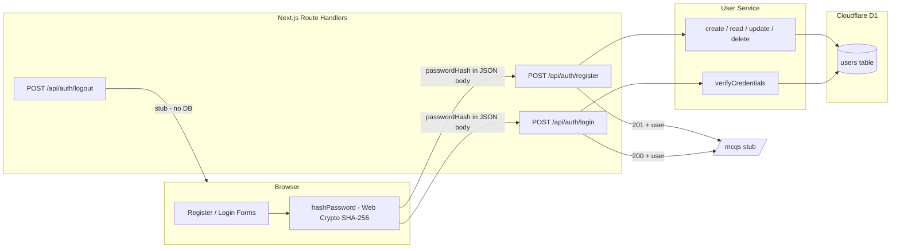

Date created: August 24, 2026
Date last modified: August 25, 2026

# User Authentication - Technical PRD

## Overview/Problem

Quizmaker is a greenfield application where multiple teachers will collaborate to create multiple-choice questions. That collaboration requires each teacher to have a distinct identity in the system. The starter project has no user accounts, no persistence for identity, and no path from sign-up into the quiz-creation workflow. Without registration and login, teachers cannot securely access the app as individual users, and there is no foundation for future shared MCQ features.

---

## Hypothesis

We believe that providing email-and-password registration, login, and logout—with passwords hashed in the browser before any HTTP POST—will let multiple teachers create accounts and reach an MCQ workspace stub quickly, establishing the identity layer needed for collaboration without the complexity of sessions or social providers.

---

## Scope

### In Scope

- **Database migration** for a `users` table (create the migration file; apply locally during development only)
- **Cloudflare D1 setup** — create database, add `DB` binding to `wrangler.jsonc`, run `npm run cf-typegen`
- **User service** (`src/lib/services/user-service.ts`) with create, read, update, and delete methods backed by D1
- **Client-side password hashing** before any HTTP POST — the password entered in the browser is hashed before transmission during both registration and login; plaintext never goes over the wire
- **API route handlers** (HTTP POST), each delegating to the user service for database reads/writes:
  - `POST /api/auth/register` — create a new user
  - `POST /api/auth/login` — verify credentials (compare stored hash to submitted hash)
  - `POST /api/auth/logout` — stub endpoint that acknowledges logout (no server-side session to destroy yet)
- **UI pages**:
  - Registration page with form
  - Login page with form
  - MCQ stub page (`/mcqs`) — placeholder only; no MCQ creation logic (built next sprint)
- **Post-auth navigation** — successful registration or login redirects the user to `/mcqs`
- **Input validation** with Zod on all API route handler payloads
- **Error handling** — clear validation and auth failure messages in the UI

### Out of Scope

- Social / OAuth login (Google, Microsoft, etc.)
- Session management — no cookies, JWTs, or server-side sessions
- Password reset or email verification flows
- Role-based access control (admin, teacher, student)
- MCQ creation, editing, listing, or collaboration (next sprint)
- Protecting `/mcqs` behind authentication (no session exists yet; redirect is UX-only)
- Applying migrations to the remote D1 database

### Cut

- **Server Actions for auth forms** — cut in favor of explicit HTTP POST endpoints; route handlers give a clear API surface for future clients
- **Server-side bcrypt/argon2 hashing** — cut for this sprint; client sends a hash over the wire and the server stores/compares that hash. A future session-management sprint should add server-side salting and proper password hashing before production use
- **Remember-me / persistent login** — requires sessions; deferred
- **Rate limiting on auth endpoints** — valuable but not required for the initial stub; add when sessions ship

---

## Technical Requirements

### System Architecture



**Layering rules:**

1. UI forms hash the password, then `fetch` POST to API routes.
2. Route handlers validate with Zod, then call the user service — they never query D1 directly.
3. The user service owns all SQL and returns user objects without `password_hash` to callers.
4. Logout is a stub until session management ships.

### Database Schema

Create a D1 migration with the following table. Email is the natural login identifier for teachers.

```sql
CREATE TABLE users (
  id TEXT PRIMARY KEY DEFAULT (lower(hex(randomblob(16)))),
  email TEXT NOT NULL UNIQUE,
  password_hash TEXT NOT NULL,
  first_name TEXT NOT NULL,
  last_name TEXT NOT NULL,
  created_at DATETIME DEFAULT CURRENT_TIMESTAMP,
  updated_at DATETIME DEFAULT CURRENT_TIMESTAMP
);

CREATE INDEX idx_users_email ON users(email);
```

**Column notes:**

| Column | Purpose |
|--------|---------|
| `id` | Opaque primary key; generated by SQLite |
| `email` | Unique login identifier; stored lowercase |
| `password_hash` | Hash produced client-side before POST; never store plaintext |
| `first_name`, `last_name` | Display identity for collaborating teachers |
| `created_at`, `updated_at` | Audit timestamps; `updated_at` refreshed on update |

### API Endpoints

All auth endpoints accept and return JSON. Password fields in request bodies contain the **client-side hash**, not the raw password.

#### POST /api/auth/register

Creates a new user through the user service.

**Request Body:**
```json
{
  "email": "teacher@school.edu",
  "passwordHash": "sha256-hex-string-from-client",
  "firstName": "Jane",
  "lastName": "Doe"
}
```

**Response:**
- Success (201): `{ "user": { "id": "...", "email": "...", "firstName": "...", "lastName": "..." } }`
- Error (400): `{ "error": "Validation error message" }`
- Error (409): `{ "error": "An account with this email already exists" }`
- Error (500): `{ "error": "Internal server error" }`

#### POST /api/auth/login

Verifies credentials through the user service. Compares the submitted `passwordHash` to the stored `password_hash`. No session is created; response confirms identity only.

**Request Body:**
```json
{
  "email": "teacher@school.edu",
  "passwordHash": "sha256-hex-string-from-client"
}
```

**Response:**
- Success (200): `{ "user": { "id": "...", "email": "...", "firstName": "...", "lastName": "..." } }`
- Error (400): `{ "error": "Validation error message" }`
- Error (401): `{ "error": "Invalid email or password" }`
- Error (500): `{ "error": "Internal server error" }`

#### POST /api/auth/logout

Stub endpoint for future session invalidation. Returns success immediately.

**Request Body:** none (or empty JSON `{}`)

**Response:**
- Success (200): `{ "message": "Logged out" }`

### Client-Side Password Hashing

Hash passwords in the browser **before** calling register or login endpoints. Use the Web Crypto API so no additional dependency is required.

```typescript
// src/lib/auth/hash-password.ts
export async function hashPassword(plainPassword: string): Promise<string> {
  const encoder = new TextEncoder();
  const data = encoder.encode(plainPassword);
  const hashBuffer = await crypto.subtle.digest("SHA-256", data);
  return Array.from(new Uint8Array(hashBuffer))
    .map((b) => b.toString(16).padStart(2, "0"))
    .join("");
}
```

The plain password never appears in the HTTP request body. The same function runs on registration and login so the server can compare `password_hash` values directly.

### User Service

Centralize all D1 access in `src/lib/services/user-service.ts`. Register and login route handlers call this service; they do not query D1 directly.

| Method | Signature | Behavior |
|--------|-----------|----------|
| `createUser` | `(db, input) => User` | Insert row; throw on duplicate email |
| `getUserById` | `(db, id) => User \| null` | Fetch by primary key |
| `getUserByEmail` | `(db, email) => User \| null` | Fetch by email (lowercased) |
| `updateUser` | `(db, id, input) => User` | Update allowed fields; refresh `updated_at` |
| `deleteUser` | `(db, id) => boolean` | Hard delete; return whether a row was removed |
| `verifyCredentials` | `(db, email, passwordHash) => User \| null` | Lookup by email; compare `password_hash`; return user or null |

Return types omit `password_hash` from objects sent to the client.

### User Interface Requirements

#### Registration Page (`/register`)

- Form fields: first name, last name, email, password, confirm password
- Client-side validation:
  - All fields required
  - Email format valid
  - Password minimum 8 characters
  - Confirm password matches password
- On submit: hash password client-side → `POST /api/auth/register` with hash
- On success: redirect to `/mcqs`
- On error: display message via `FieldError` (shadcn `field` component)
- Link to login page for existing users

#### Login Page (`/login`)

- Form fields: email, password
- Client-side validation: both fields required; email format valid
- On submit: hash password client-side → `POST /api/auth/login` with hash
- On success: redirect to `/mcqs`
- On error: display generic "Invalid email or password" (do not reveal which field failed)
- Link to registration page for new users

#### MCQ Stub Page (`/mcqs`)

- Static placeholder confirming the user reached the post-auth destination
- Heading such as "MCQ Workspace" with brief copy: full MCQ creation arrives next sprint
- No quiz data, forms, or API calls
- Optional link back to `/login` (logout is client-side redirect only until sessions exist)

#### Home Page (`/`)

- Update starter landing page with navigation links to `/register` and `/login`

---

## Implementation Phases

### Phase 1: Database Foundation - COMPLETED

**Objective**: D1 is configured locally and the users table migration exists.

**Tasks**:
1. Run `npx wrangler d1 create aisprint-quizmaker-db` (or agreed name)
2. Add `d1_databases` binding (`DB`) to `wrangler.jsonc`
3. Run `npm run cf-typegen`
4. Create migration: `npx wrangler d1 migrations create aisprint-quizmaker-db create_users_table`
5. Add `CREATE TABLE users` SQL to the migration file
6. Apply locally: `npx wrangler d1 migrations apply aisprint-quizmaker-db --local`

**Deliverables**:
- `wrangler.jsonc` updated with D1 binding
- `migrations/0001_create_users_table.sql` (or next sequence number)
- Typed `env.DB` in `cloudflare-env.d.ts`

### Phase 2: User Service - PLANNED

**Objective**: All user CRUD and credential verification live in one service module.

**Tasks**:
1. Add `zod` dependency (validation required by project conventions)
2. Define `User`, `CreateUserInput`, `UpdateUserInput` types
3. Implement `createUser`, `getUserById`, `getUserByEmail`, `updateUser`, `deleteUser`, `verifyCredentials`
4. Use prepared statements with numbered placeholders (`?1`, `?2`)
5. Normalize email to lowercase on write and lookup

**Deliverables**:
- `src/lib/services/user-service.ts`
- `src/lib/services/user-service.types.ts` (optional, if types grow)

### Phase 3: Auth API Endpoints - PLANNED

**Objective**: Register, login, and logout HTTP endpoints wired to the user service.

**Tasks**:
1. Create Zod schemas for register and login request bodies
2. Implement `POST /api/auth/register` route handler
3. Implement `POST /api/auth/login` route handler
4. Implement `POST /api/auth/logout` stub route handler
5. Access D1 via `getCloudflareContext()` from `@opennextjs/cloudflare`
6. Return consistent JSON error shapes

**Deliverables**:
- `src/app/api/auth/register/route.ts`
- `src/app/api/auth/login/route.ts`
- `src/app/api/auth/logout/route.ts`

### Phase 4: Client Hashing Utility - PLANNED

**Objective**: Shared browser-side hashing used by both auth forms.

**Tasks**:
1. Implement `hashPassword` using Web Crypto API
2. Ensure function is safe to import from client components (`'use client'` pages)

**Deliverables**:
- `src/lib/auth/hash-password.ts`

### Phase 5: Auth UI and MCQ Stub - PLANNED

**Objective**: Teachers can register, log in, and land on the MCQ placeholder page.

**Tasks**:
1. Build registration page with shadcn `field`, `input`, `button`, `card`
2. Build login page with same component set
3. Wire forms to hash password then `fetch` POST to API routes
4. Handle loading and error states
5. Create `/mcqs` stub page
6. Update home page with auth navigation links

**Deliverables**:
- `src/app/register/page.tsx`
- `src/app/login/page.tsx`
- `src/app/mcqs/page.tsx`
- Updated `src/app/page.tsx`

### Phase 6: Verification - PLANNED

**Objective**: Feature meets acceptance criteria on the Workers runtime.

**Tasks**:
1. Run `npm run lint` — zero errors
2. Run `npm run build` — succeeds
3. Run `npm run preview` — manually test register → `/mcqs`, login → `/mcqs`, duplicate email, bad credentials
4. Mark acceptance criteria complete

**Deliverables**:
- Lint and build passing
- Manual test notes recorded in Current Status

---

## Technical Implementation Details

### Key Files

| File | Purpose |
|------|---------|
| `wrangler.jsonc` | D1 database binding configuration |
| `migrations/*.sql` | Users table schema |
| `src/lib/services/user-service.ts` | D1 queries for user CRUD and credential check |
| `src/lib/auth/hash-password.ts` | Client-side SHA-256 hashing before POST |
| `src/app/api/auth/register/route.ts` | Registration HTTP endpoint |
| `src/app/api/auth/login/route.ts` | Login HTTP endpoint |
| `src/app/api/auth/logout/route.ts` | Logout stub endpoint |
| `src/app/register/page.tsx` | Registration form UI |
| `src/app/login/page.tsx` | Login form UI |
| `src/app/mcqs/page.tsx` | MCQ workspace stub for next sprint |

### Implementation Patterns

**Accessing D1 in a route handler:**

```typescript
import { getCloudflareContext } from "@opennextjs/cloudflare";
import { createUser } from "@/lib/services/user-service";

export async function POST(request: Request) {
  const { env } = getCloudflareContext();
  const body = await request.json();
  // validate with Zod, then:
  const user = await createUser(env.DB, validated);
  return Response.json({ user }, { status: 201 });
}
```

**Prepared statement pattern (D1 convention):**

```typescript
const { results } = await db
  .prepare("SELECT id, email, first_name, last_name FROM users WHERE email = ?1")
  .bind(email.toLowerCase())
  .all<UserRow>();
const user = results[0] ?? null;
```

**Client form submit pattern:**

```typescript
const passwordHash = await hashPassword(password);
const res = await fetch("/api/auth/login", {
  method: "POST",
  headers: { "Content-Type": "application/json" },
  body: JSON.stringify({ email, passwordHash }),
});
if (res.ok) router.push("/mcqs");
```

### Important Notes

- D1 is only reachable from server code. Never import `user-service.ts` into `'use client'` components.
- `npm run dev` uses Node and may not expose D1 bindings. Test auth flows with `npm run preview`.
- Logout is a no-op on the server until session management is added; the UI should redirect away from `/mcqs` after calling the stub endpoint.
- Without sessions, `/mcqs` is not protected — anyone with the URL can view the stub. This is acceptable for this sprint.
- Email uniqueness is enforced at the database level (`UNIQUE` constraint) and in the service layer (catch conflict on insert).

---

## Acceptance Criteria

- [x] D1 database is configured in `wrangler.jsonc` with binding name `DB`
- [x] Users table migration file exists under `migrations/`
- [ ] User service exposes create, read (by id and email), update, delete, and verifyCredentials
- [ ] `POST /api/auth/register` creates a user and returns user object without password hash
- [ ] `POST /api/auth/login` returns user on valid credentials and 401 on invalid credentials
- [ ] `POST /api/auth/logout` returns 200 with acknowledgment message
- [ ] Plaintext password never appears in HTTP request bodies (only client-side hash)
- [ ] Registration form validates inputs and redirects to `/mcqs` on success
- [ ] Login form validates inputs and redirects to `/mcqs` on success
- [ ] Duplicate email registration returns a clear error in the UI
- [ ] `/mcqs` stub page renders with placeholder content
- [ ] `npm run lint` passes
- [ ] `npm run build` passes
- [ ] Auth flows verified with `npm run preview`

---

## Success Metrics

| Metric | Target | How Measured |
|--------|--------|--------------|
| Registration completion | User reaches `/mcqs` after valid registration | Manual test in preview |
| Login completion | User reaches `/mcqs` after valid login | Manual test in preview |
| No plaintext on wire | Request bodies contain `passwordHash` only | Inspect network tab during manual test |
| Duplicate email handling | 409 response with readable UI error | Attempt second registration with same email |

---

## Dependencies

### External Dependencies

- **Cloudflare D1** — SQLite database for user persistence
- **Web Crypto API** — client-side SHA-256 hashing (browser built-in)

### Internal Dependencies

- **`getCloudflareContext()`** — access `env.DB` in route handlers
- **shadcn/ui components** — `button`, `card`, `field`, `input`, `label` for forms
- **`zod`** — request validation (must be added; not yet in `package.json`)

### Environment Variables

None required for this sprint. No API keys or secrets needed for basic email/password auth with client-side hashing.

---

## Risks and Mitigation

### Technical Risks

- **Risk**: Client-side SHA-256 without salt is weak if the hash is intercepted and replayed
- **Mitigation**: Document as intentional MVP trade-off; plan server-side bcrypt/argon2 + sessions in a follow-up sprint. Use HTTPS in production (Cloudflare default)

- **Risk**: D1 bindings unavailable in `npm run dev`
- **Mitigation**: Document and test with `npm run preview`; note in UI dev workflow

- **Risk**: No session means login state is lost on refresh and `/mcqs` is public
- **Mitigation**: Explicitly out of scope; stub page is not sensitive; session sprint follows

### User Experience Risks

- **Risk**: Users expect to stay logged in after closing the browser
- **Mitigation**: Copy on login/register pages can note that persistent sessions arrive in a future update

- **Risk**: Confusion about logout doing nothing persistent
- **Mitigation**: Logout button redirects to `/login`; stub endpoint exists for API consistency

---

## Troubleshooting Guide

_(Populate during implementation.)_

### D1 binding not found in dev

**Problem**: `env.DB` is undefined when running `npm run dev`
**Cause**: Node dev server does not emulate Cloudflare bindings
**Solution**: Use `npm run preview` for auth testing

### Migration apply fails locally

**Problem**: `wrangler d1 migrations apply` errors
**Cause**: Database name in command does not match `wrangler.jsonc`, or migration SQL syntax error
**Solution**: Verify database name with `npx wrangler d1 migrations list <db>`; inspect migration SQL

---

## Notes for AI Agents

When working with this PRD:

1. Start by reading the Problem and Hypothesis to understand intent
2. Use Scope (In/Out/Cut) to determine boundaries — do not build social login, sessions, cookies, or MCQ features
3. Create the migration file; apply locally only (`--local`). Never apply migrations with `--remote`
4. Route handlers call the user service; the user service owns all D1 queries
5. Hash passwords client-side before POST; never send or log plaintext passwords
6. Update phase status markers as work progresses
7. Mark acceptance criteria complete only after `npm run lint`, `npm run build`, and preview testing
8. Ask before adding dependencies other than `zod`

---

## Current Status

**Last Updated**: August 25, 2026
**Current Phase**: Phase 1 - Database Foundation (complete; awaiting review)
**Status**: COMPLETED
**Next Steps**: Phase 2 - User Service (after approval)
